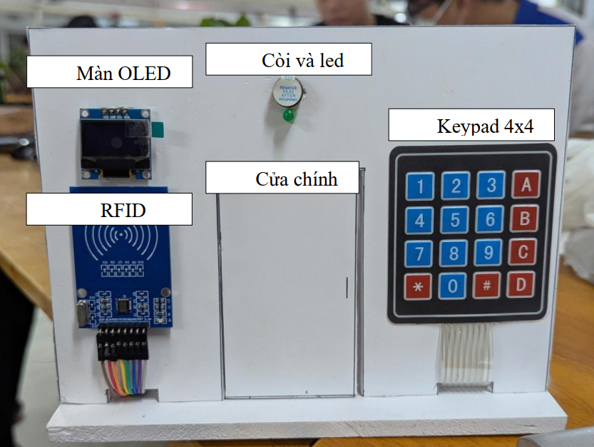
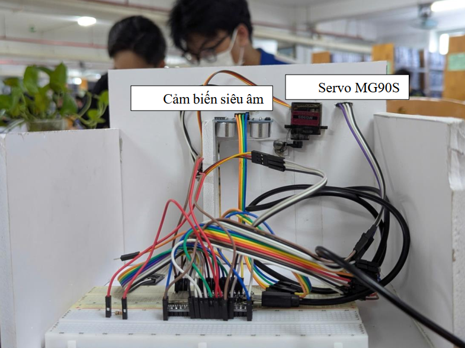
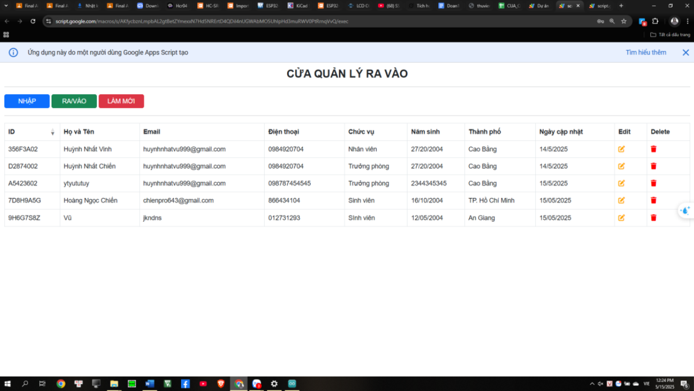
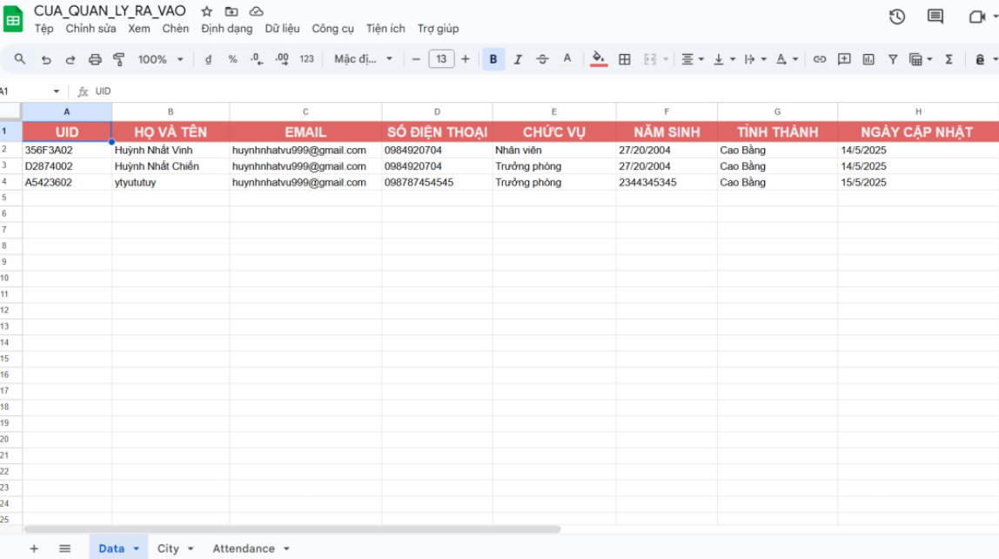
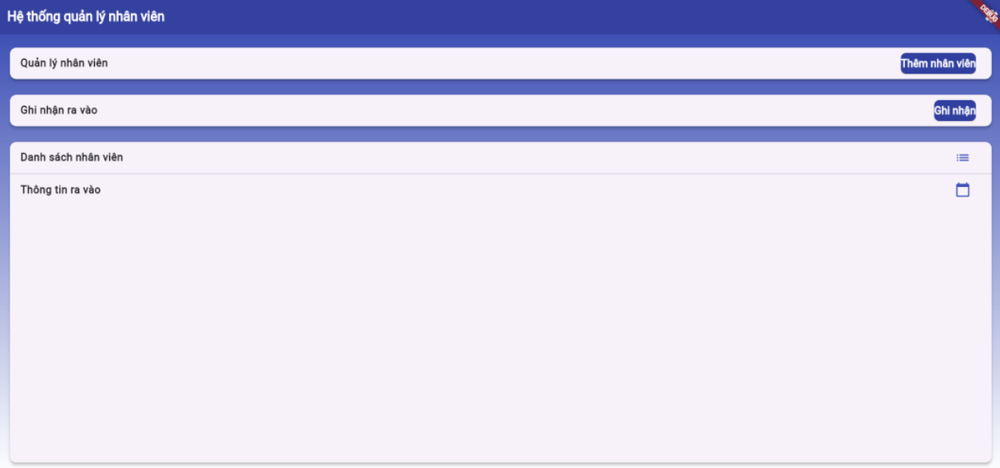

# 🚪 Thiết Kế Hệ Thống Cửa Quản Lý Ra Vào Thông Minh

## 🧠 Giới thiệu

Đồ án được thực hiện trong khuôn khổ học phần *Hệ thống nhúng và IoT* – Trường Đại học Sư phạm Kỹ thuật TP.HCM, dưới sự hướng dẫn của **TS. Huỳnh Thế Thiện**.

Mục tiêu của đề tài là **xây dựng một hệ thống khóa cửa thông minh** có khả năng:
- Mở cửa bằng **thẻ RFID** với khả năng nhận dạng UID.
- Ghi nhận lịch sử ra/vào **thời gian thực** lên **Google Sheets**.
- Cho phép **quản lý nhân viên** qua **Web App** và **ứng dụng Android**.
- Cảnh báo khi quét sai thẻ, hiển thị trạng thái trên **màn hình OLED**, và điều khiển **servo** để mở cửa.
---

## ⚙️ Thành phần chính

### 🧩 Phần cứng
- **ESP32-DevKitC-32U** – Vi điều khiển trung tâm (Wi-Fi, Bluetooth).
- **RC522 RFID Module** – Đọc thẻ RFID.
- **OLED SSD1306 (I2C)** – Hiển thị trạng thái và thông tin người dùng.
- **Servo MG90S** – Mô phỏng cơ cấu mở cửa.
- **HC-SR04 Ultrasonic Sensor** – Phát hiện vật cản, giữ cửa mở khi có người.
- **Keypad 4x4** – Nhập mật khẩu khẩn cấp.
- **Buzzer & LED** – Báo hiệu khi quét sai hoặc cảnh báo.
- **Nguồn 5V (sạc dự phòng hoặc củ sạc)**.

---

## 🧰 Phần mềm

### 1. **Firmware (ESP32)**
- Viết bằng Arduino IDE / PlatformIO.
- Chức năng:
  - Đọc UID từ RFID.
  - Gửi request HTTP đến Google Apps Script.
  - Điều khiển servo, buzzer, OLED hiển thị trạng thái.
  - Quản lý bàn phím Keypad và cảm biến siêu âm.

### 2. **Google Sheets + AppScript**
- **Google Sheets** đóng vai trò như *cơ sở dữ liệu thời gian thực*.
- Các sheet chính:
  - `Data`: Danh sách nhân viên & mã UID.
  - `Attendance`: Lịch sử ra/vào.
  - `City`: Dữ liệu hỗ trợ nhập liệu.
- **AppScript** dùng để:
  - Xử lý yêu cầu từ ESP32 qua HTTP.
  - Cập nhật dữ liệu trên Google Sheets.
  - Tạo Web App quản lý nhân viên.

### 3. **Web App**
- Giao diện được xây dựng bằng **HTML/CSS/JS** trong Google AppScript.
- Chức năng:
  - Thêm, xóa, chỉnh sửa nhân viên.
  - Xem lịch sử điểm danh.
  - Kết nối thời gian thực với Google Sheets.

### 4. **Ứng dụng Android (Flutter)**
- Giao diện đơn giản, trực quan, tối ưu cho điện thoại.
- Các chức năng chính:
  - Thêm nhân viên (có nhập UID, họ tên, ngày sinh,…).
  - Check-in / Check-out.
  - Danh sách nhân viên.
  - Xem thông tin ra vào.

---

## 📂 Cấu trúc thư mục đề xuất

#### 🧩 Chức năng tổng quan
| File | Vai trò chính |
|------|----------------|
| **Code.gs** | Xử lý logic hệ thống, nhận dữ liệu từ ESP32, ghi/đọc Sheet, trả phản hồi JSON. |
| **Index.html** | Trang chính của Web App, gọi các file HTML phụ để hiển thị. |
| **Form.html** | Biểu mẫu nhập liệu (thêm, sửa nhân viên). |
| **DataTable.html** | Hiển thị danh sách nhân viên từ Google Sheet. |
| **SpinnerModal.html** | Hộp thoại hiển thị tiến trình khi đang tải dữ liệu. |
| **JavaScript.html** | Chứa các hàm xử lý sự kiện (onclick, submit, fetch API). |
| **Stylecss.html** | Giao diện CSS cho toàn bộ Web App. |
---

---
## 🚪 Mô hình phần cứng

### 🔹 Mặt trước mô hình cửa

### 🔹 Mặt sau mô hình cửa

---

## 💻 Giao diện hệ thống

### 🌐 Giao diện Web App

### 📊 Giao diện Google Sheets

### 📱 Giao diện Ứng dụng Android

## 🚀 Cách hoạt động

1. Người dùng quét thẻ RFID → ESP32 đọc UID.
2. ESP32 gửi UID qua HTTP request đến AppScript (Web App URL).
3. AppScript xác thực UID trong Google Sheets:
   - Nếu **đúng**, ghi thời gian ra/vào vào `Attendance`, điều khiển servo mở cửa.
   - Nếu **sai**, bật buzzer cảnh báo và hiển thị lỗi trên OLED.
4. Người quản lý có thể thêm/xóa nhân viên hoặc xem lịch sử qua Web App hoặc Android App.

---

## 📊 Kết quả & Đánh giá

- Hệ thống hoạt động ổn định, dữ liệu ra/vào được cập nhật theo thời gian thực.
- Web App và Android App giao diện thân thiện, dễ dùng.
- Có thể mở rộng thêm các tính năng:
  - Gửi thông báo Telegram / Email khi có truy cập.
  - Bảo mật đăng nhập cho Web App.
  - Ghi nhận dữ liệu môi trường (nhiệt độ, ánh sáng).

---
